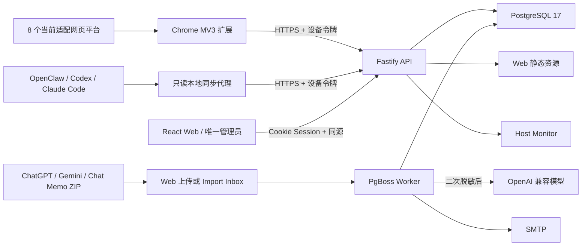

# 知言归藏 V2.3 系统架构与详细设计说明书

> 同步日期：2026-08-28。本文整合原架构概览和系统设计，描述当前总体架构与详细设计；字段级模型见 [05-数据库设计](05-数据库设计.md)，接口和限制见 [06-接口设计](06-接口设计.md) 与 [01-产品功能与业务规则](01-产品功能与业务规则.md)。

| 文档属性 | 内容 |
| --- | --- |
| 文档类型 | 软件架构设计说明书（SAD）与详细设计说明书（SDD） |
| 配置项标识 | `DOC-ARCH-V2.3` |
| 适用版本 | V2.3.0 |
| 状态 | 发布基线 |
| 事实来源 | 当前代码、Migration 0000–0022、Compose 与自动化测试 |
| 变更控制 | 架构、数据所有权、认证域或部署拓扑变化时必须同步更新 |

## 1. 架构目标

系统围绕原始 AI 会话构建。PostgreSQL 中的 Conversation、Revision、Message 和 Segment 是事实来源；项目和标签提供可修改的组织视图，全文分块是可重建索引，Report 是周期输出，Project Context 是按需生成的下载内容。

数据流：Chrome/本地同步/历史 ZIP → Fastify API 或 Import Worker → PostgreSQL 版本化归档 → 项目与标签整理 → 搜索、Diff、时间线、导出、报告和 Context。

部署目标是单实例、单管理员的自托管服务，不设计多租户隔离或横向扩展协议。

### 1.1 总体架构图

### 1.2 质量属性与设计约束

| 质量属性 | 设计响应 | 验证方式 |
| --- | --- | --- |
| 数据正确性 | Revision 不可变、会话级 advisory lock、事务写入、半开日期区间 | Migration/服务测试、完整性检查、恢复演练 |
| 可恢复性 | 数据库灾备与业务备份双轨、Restore 提交边界、`recovery_required` | 备份校验、Worker 中断与灾备恢复演练 |
| 安全性 | 单管理员双因素认证、设备 Token 哈希、同源校验、SSRF 防护、双重脱敏 | 安全测试、配置审查、日志审计 |
| 可维护性 | 分层工作区、Schema/Migration、统一分页、编号文档与发布门禁 | Typecheck、测试、构建和文档追踪 |
| 可观察性 | OperationLog、Activity、Adapter Health、系统状态和后台任务状态 | 生产冒烟、运行监控和故障演练 |
| 可移植性 | Docker Compose NAS 部署，Windows/macOS 同步代理独立打包 | Compose 校验和目标平台实机测试 |

归档事实优先于派生能力：Conversation、Revision、Message、Segment 不由 AI 自动“修复”；SearchChunk、报告和 Context 可以重建或重新生成。系统在没有 LLM 时仍必须完成采集、检索、版本比较、导出、备份与恢复。

## 2. 运行组件

| 组件 | 当前职责 |
| --- | --- |
| `apps/server` app | Fastify API、认证、迁移、Web 静态资源、交互式 Context |
| `apps/server` worker | PgBoss 消费、Cron、分类、报告、邮件、导入、异步恢复、归档完整性检查、历史脱敏和 housekeeping |
| `apps/server` host-monitor | 只读读取 `/proc`、cgroup 和数据文件系统指标 |
| `apps/web` | React 单页管理后台 |
| `apps/extension` | Chrome 自动采集、轻量变化检测、增量上传、持久 Outbox |
| `apps/openclaw-sync` | Windows/macOS 扫描和监听 OpenClaw、Codex、Claude Code 文件 |
| `packages/contracts` | Provider、设备、消息、Segment、采集和 AI 输出 Zod 协议 |
| PostgreSQL 17 | 业务数据、迁移和 PgBoss 队列 |

## 3. 身份与安全域

系统有两个认证域：

- Web：唯一管理员使用密码、TOTP 和 30 天 HttpOnly Cookie Session；所有非安全方法还要通过 `APP_ORIGIN` 同源检查。
- 设备：Chrome、本地同步和协议预留的 importer 领取 Bearer Token，服务器只保存 SHA-256 哈希。设备 kind 当前不限制可调用的采集能力。

管理员可修改密码、两阶段重新绑定 TOTP、查看 Session、注销单个或其他 Session。pending TOTP 只有经新验证码确认后才替换旧密钥；服务器侧恢复 CLI 可重置密码/TOTP或注销全部 Session。`/auth/me` 的 401、网络故障和 5xx 在 Web 中分别呈现。Worker 每天 03:20 物理清理过期 Session 和配对码。

## 4. Chrome 与本地同步

Chrome 扩展以 optional host permissions 控制归档服务器和 AI 站点访问，当前适配 8 类网页平台。轻量检测比较 Session、消息数、末条消息和流式状态；确认变化后执行完整或增量扫描。增量基线在虚拟列表中找不到时强制回退完整扫描。网络失败写入 IndexedDB Outbox，Popup 可检查/重试/删除；401 清除失效凭据并标记 AUTH_REVOKED，但保留队列供重新配对后续传。CaptureRun 按 provider+adapterVersion 聚合健康度。

本地同步代理把配置和增量状态以 0600 权限写在用户目录。默认安全窗口为 14 天、核心 CLI 最多 500 文件；Windows/macOS 包装脚本进一步限制为 60 文件、50 MiB/文件、12,000 消息/会话和文件间 750 ms。扫描拒绝符号链接，只允许远程 HTTPS 或本机 HTTP。

## 5. 归档、幂等、事务与删除

Conversation 以 `provider + externalSessionId` 唯一。每个非重复捕获创建不可变 Revision 元数据：

- 完整/import 快照保存逻辑完整消息。
- append 验证 `baseRevisionId`、消息数和末消息指纹；通过后保存 delta，并在读取时物化完整逻辑序列。
- 相同 Conversation 的 `revisionIdentityHash` 唯一；`snapshotHash` 保留内容身份，同一设备的 idempotency key 也唯一。V2.3 客户端从已组装的最终上传 payload 生成键，重试保持同键，标题、时间或正文变化则使用新键。对无 `payloadIdentityHash` 的升级前 CaptureRun，若当前规范化结果与旧 hash 不同，本次请求忽略无法验证的旧键，仍由 Revision identity 去重；新 CaptureRun 继续严格拒绝同键不同 payload。
- 服务端使用按会话 advisory lock 和数据库事务，避免同一会话并发写入造成重复或基线竞争。

最新 Revision 按 complete 优先，再以 capturedAt、createdAt、ID 决胜。搜索、详情、Dashboard、报告与导出按各自用途复用这一规则或窗口内变体。

普通删除只设置 `conversations.deletedAt`，常规列表和业务查询排除该记录。回收站支持恢复；永久删除要求请求体确认值为 `DELETE`。Worker 每天清理超过 30 天的软删除会话。

## 6. 内容处理与全文检索

入库前先清理控制字符、二进制/超长工具载荷，并执行内置与自定义 storage 脱敏。发送 LLM 前再次执行 cloud 脱敏，外部会话内容始终视为不可信输入。

Revision 的 `searchText` 仍是最长 2,048 字符的摘要索引，但完整消息会按长度切入 `conversation_search_chunks`。英文等可分词文本通过生成列 `search_vector` 和 GIN 索引检索；连续文本及精确字面语义保留转义后的 `ILIKE` 回退。搜索 `%`、`_` 和反斜线按普通字符处理，不再隐式充当 SQL 通配符。全文分块是派生数据，恢复后可从 Message/Segment 重建。

项目过滤连接 `conversation_projects`；多标签通过 `conversation_tags` 统计是否覆盖所有请求标签，语义为 AND。日期区间为 from 包含、to 不包含。列表统一返回 `items + pagination(total/limit/offset/hasMore)`。

## 7. 项目、标签与自动整理

`conversation_projects` 以 conversationId 为主键，确保一条会话最多一个主项目。项目名写入前执行 NFKC、首尾去空格和连续空白折叠，`normalizedName` 负责大小写无关唯一性；空名返回 400，冲突返回 409。

`conversation_tags` 使用 conversationId/tagId 复合主键，允许多标签。Tag 合并在事务内按稳定顺序获取 advisory lock，再读取并合并关系，防止并发丢失。

自动整理流程：

1. 选择候选会话和最新优先完整 Revision。
2. 读取未归档项目和已有标签，按会话材料与项目名称/说明的词项相关性筛出最多 80 个正相关项目，再读取这些候选的近期示例。
3. 对有限正文再次脱敏。
4. 调用 OpenAI 兼容接口获取一个项目建议和标签建议。
5. 应用项目粒度、置信度、候选相关性、标签复用和最多 10 个标签规则；零相关建议降级为确定性粗主题。
6. 保留人工项目锁，以及 manual 或 locked 的标签关系。
7. 更新固定候选列表的 offset；额度不足时按 retryAt/quotaResetAt 延迟续跑。

“交还 AI 管理”会把人工标签关系真正转换为 `source=auto`、解除锁定并清空人工 confidence，然后触发单会话整理。人工调整或释放项目时会清空过期 `suggestedName`。

项目归档保留已有关系但阻止新分配；Project 与 Tag 合并都使用事务和稳定顺序 advisory lock。

## 8. 时间线、Revision Diff 与 Project Context

项目时间线为每条项目会话选择最新完整优先 Revision，返回 total、limit、offset、标签及可打开的 href；Web 使用统一分页组件，不调用 AI。

Revision Diff 比较目标 Revision 与其上一版物化消息序列，返回新增、删除、修改消息数量及逐条差异。V2.3 新 Revision 还保存 `capturedTitle`、`capturedCanonicalUrl` 与 `metadataCaptured=true`，因此可以比较采集时标题和规范 URL；Migration 前旧 Revision 使用 `metadataCaptured=false`，这部分历史元数据保持不可验证而不以 Conversation 当前值伪造。

`POST /projects/:id/context` 每次即时生成 Markdown：

- 确定性部分包含项目说明、规模、标签、活动、历史索引和来源。
- `{ai:true}` 使用 interactive 优先级生成整体叙述。
- `{ai:false}` 不调用模型。
- Web 同时提供“智能总结 + 历史索引”和“仅历史索引”；AI 失败时询问是否降级基础版本。
- 结果不持久化，也没有定时重建。

## 9. 报告与邮件

周报窗口为实例 `TZ` 上一完整周，月报为该时区上一完整月。生成时只选择 complete Revision，每会话取窗口内最新一版，正文最多取 6,000 字符；月报可加入同窗口周报。周期查询统一为 `[windowStart, windowEnd)`，支持 DST 的 IANA 时区语义。

材料与周报引用都使用 `[windowStart, windowEnd)` 半开区间，相邻周期不会重复统计边界数据。LLM 结构化结果规范化后写入 `reports`，运行状态写 `analysis_runs`。若 PgBoss 入队返回 null，接口立即把运行标记为 failed 并返回 503，允许用户重试，不遗留 queued 幽灵任务。

Worker 周一 07:30 和每月 1 日 08:00 触发报告；SMTP job 发送完整 Markdown 正文及 Web 链接。Report 行上的 `emailStatus`、`emailAttempts`、`emailSentAt` 和 `emailError` 是用户态投递状态事实，Web 可重试 failed 邮件；PgBoss 与 OperationLog 用于深度排障。

## 10. 队列与定时任务

PgBoss 队列：`analysis-weekly`、`analysis-monthly`、`classify-conversation`、`reclassify-unlocked`、`nightly-ai-maintenance`、`import-archive`、`email-report`、`redact-storage`、`restore-backup`、`archive-integrity`。

Cron：周一 07:30 周报、每月 1 日 08:00 月报、周日 06:15 可选增量整理、每天 22:00 可选夜间维护、每天 03:20 housekeeping、每天 03:40 归档完整性检查，以及每 5 分钟报告延迟恢复和 Import Inbox 扫描。Housekeeping 清理过期认证状态、按配置保留期删除 processed/failed ZIP 和 pre-commit failed Restore 文件、补删 completed/cancelled Restore 暂存文件，并永久删除超过 30 天的回收站会话。

Worker 停止时自动任务不会执行。现有唯一约束、singleton key 和任务复用降低重复，但仓库没有多 Worker 并发压力实测。

## 11. 历史 ZIP 导入

Web 上传把 ZIP 写入 inbox 并创建 `import_jobs`，Worker 识别 ChatGPT、Gemini 和 Chat Memo。导入限制压缩大小、路径穿越、文件/目录条目数、单条目和总展开大小。

文件哈希保持唯一，但 failed/partial 任务再次上传相同 ZIP 时会复用原 ImportJob、增加 `attempt`、记录 `lastRetryAt` 并重新入队；Web 也提供显式重试。每个快照独立事务化，因此整个 ZIP 不是总事务。出现部分成功时状态为 `partial`，统计 imported/unchanged/failed/total。processed 和 failed 文件按配置天数清理，也可从 UI 立即清理。

## 12. 备份与恢复

Web 业务备份通过独占数据库连接开启 `REPEATABLE READ READ ONLY` 事务，在同一快照中流式导出 18 张业务表并 gzip。不含 users、web_sessions、pairing_codes、派生全文分块和 PgBoss schema。

`POST /backups/verify` 只验证 gzip、格式、Schema、18表、引用、Delta基线、计数和主密钥指纹。正式恢复把 HTTP 上传流式写入 app/worker 共享且可写的 `RESTORE_STAGING`，返回202。Worker 驱动 `queued → validating → validated → restoring → rebuilding_search → verifying → completed`：

- `restoring` 的 18 张事实表替换位于同一事务；回滚或提交前失败进入 `failed`，退出维护模式并允许用原文件完整重试。
- 事务提交时在同一数据库事务内写入 `factsCommittedAt` 和 `rebuilding_search`，消除“事实已提交但状态仍像 pre-commit”的崩溃窗口。
- 提交后的 SearchChunk 重建或 Archive Integrity 验证失败进入 `recovery_required`，继续维护模式；重试只重新执行派生检索重建和完整性验证，不再次替换事实表。
- completed/cancelled 暂存文件立即删除；pre-commit failed 文件按 `RESTORE_FAILED_RETENTION_DAYS` 保留并可从 Web 立即删除，housekeeping 清理过期文件。

Worker 当前仍会把受限大小的 staged 文件/解压 JSON 读入内存。PostgreSQL 运维脚本使用数据库级备份，覆盖管理员、Session、配对码及 PgBoss；两类备份不能互相替代。

## 13. 监控、可靠性与日志

Dashboard、可靠性摘要、日志、Activity 和系统状态都是独立读取接口。Dashboard“需要处理”聚合不完整会话、近期采集失败、超过 24 小时未恢复失败、离线设备及 failed/partial 导入，并可跳转定位。

设备页还展示 Adapter Health 与本地代理心跳。归档完整性任务校验 Revision Delta 基线、同会话关系、循环、ordinal/messageCount、可验证版本 hash、孤立关系和可重建 SearchChunk；它只报告问题，不自动改写事实档案。日志支持实例时区下的预设和自定义日期范围。

系统状态在 3 秒内尝试 Host Monitor，失败时保留数据库和文件系统部分结果；同时显示 Inbox/Processed/Failed 与 Restore Staging 的文件数、空间和保留期。项目存储使用量包含 PostgreSQL、Import 和 Restore Staging。资源告警阈值为 85%/95%；存储百分比只有设置 `ARCHIVE_STORAGE_BUDGET_GB` 才计算。

操作日志持久化 scope、level、status、entity 和脱敏 metadata。`/activity` 合并分类、分析、导入和采集运行，Web 有独立分页入口。

## 14. 网络与容器安全

- LLM/SMTP 目标只接受安全协议和 DNS 结果，默认阻止私网、回环、链路本地、云元数据和保留地址。
- Fastify 动态响应 no-store；生产启用 HSTS、CSP、COOP、Permissions Policy。
- API 错误摘要、操作日志和任务错误在持久化前再次脱敏并截断。
- Compose 中 app、worker、host-monitor 非 root、只读、no-new-privileges、drop ALL；只开放 `/tmp` tmpfs、imports、app/worker 共享的 restore staging 等必要可写卷。

## 15. 当前实现限制

- Chrome 没有豆包 adapter，虽然协议/历史数据支持该 Provider。
- Migration 前 Revision 没有真实历史标题/URL，V2.3 用 `metadataCaptured=false` 明确标记，不用当前值伪造回填。
- `snapshotHash` 承担稳定内容身份，`revisionIdentityHash` 增加标题/URL形成 Revision 去重身份；`contentIntegrityHash` 单独覆盖可重建正文、消息元数据和采集时 Revision 元数据。旧 Revision 或经历史脱敏合法改写的 Revision 保持完整性哈希空值并报告为“不可验证”，不误报损坏。
- Web 恢复已脱离 HTTP 请求，但 Restore Worker 对 staged 文件/解压 JSON 仍有内存压力，需大库实测。
- 设备撤销不可恢复；批量操作刻意不提供批量永久删除。
- 连续中文搜索仍主要使用字面 ILIKE；仓库提供 benchmark 脚本，但需要目标规模数据得出容量结论。
- 多 Worker、百万级数据、真实 SMTP/LLM 和外部站点 DOM 仍需目标环境验收。

关键代码依据：`apps/server/src/services/backup.ts`、`restore.ts`、`archive-integrity.ts`、`search-chunks.ts`、`revision-diff.ts`、`tag-merge.ts`、`analysis.ts`，`apps/server/src/routes/conversations.ts`、`backups.ts`、`imports.ts`、`reliability.ts`、`auth.ts`，`apps/server/src/worker.ts`，migration 0019–0022。
