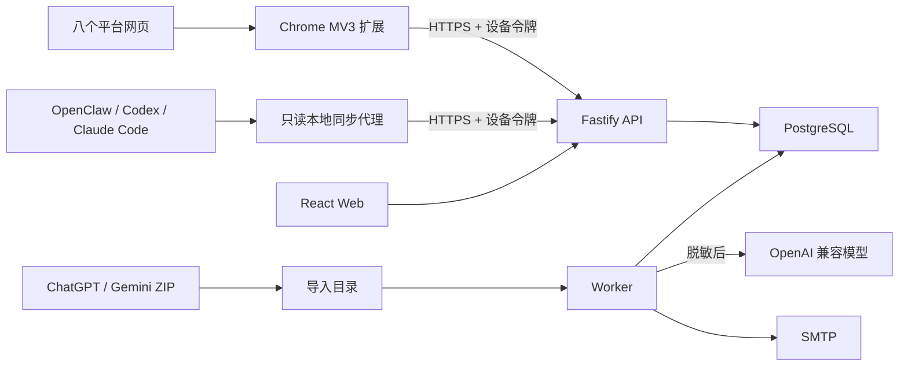

# 架构

采集主键为 `provider + externalSessionId`，内容版本由 `snapshotHash` 幂等。Chrome 扩展不会把定时器或 DOM 变化直接等同于完整扫描，而是先比较 Session、消息数量、最后消息 ID/角色/正文指纹和流式状态；未变化时只在本地短暂显示“已跳过”。新增回答优先上传 `append` 增量，服务端校验基线后物化为新的完整修订；基线不一致时返回 `incremental_base_mismatch` 并回退完整采集。

项目知识、归类、报告和后续个人分析均为归档数据库之上的可选能力。没有配置 OpenAI 兼容模型时，网页采集、本地同步、历史导入、搜索、修订查看、备份恢复仍应正常运行。
