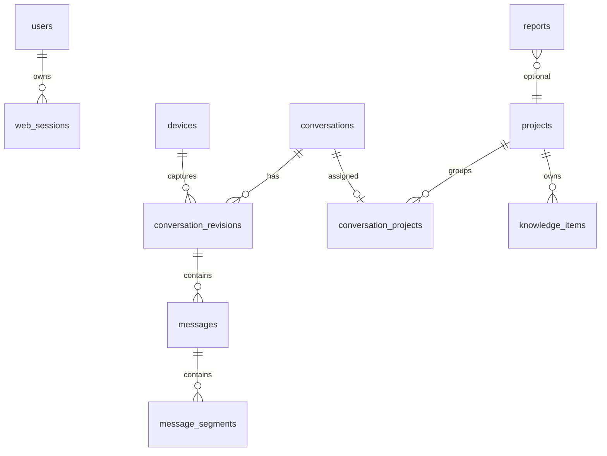

# 知言归藏数据库设计文档

## 1. 概览

数据库使用 PostgreSQL，服务端通过 Drizzle ORM 定义 Schema。核心模型围绕四条主线展开：

1. 身份与设备：管理员、Web Session、采集设备、配对码。
2. 会话归档：会话、修订版本、消息、消息分段、采集运行记录。
3. 项目知识：项目、会话项目关系、知识条目。
4. 异步运行：分析任务、后台任务、报告、导入任务、操作日志、设置、脱敏规则。

## 2. 身份与设备

### 2.1 `users`

管理员账号表。

| 字段 | 说明 |
| --- | --- |
| `id` | UUID 主键。 |
| `singletonKey` | 固定为 1 且唯一，数据库层保证只有一个管理员。 |
| `username` | 用户名，唯一。 |
| `passwordHash` | 密码哈希。 |
| `totpSecretEncrypted` | 加密后的 TOTP Secret。 |
| `createdAt` | 创建时间。 |

### 2.2 `web_sessions`

Web 后台登录会话表。

| 字段 | 说明 |
| --- | --- |
| `id` | UUID 主键。 |
| `tokenHash` | Session Token 哈希，唯一。 |
| `userId` | 关联 `users.id`。 |
| `expiresAt` | 过期时间。 |
| `createdAt` | 创建时间。 |

索引：

| 索引 | 说明 |
| --- | --- |
| `web_sessions_user_idx` | 按用户查询 Session。 |

### 2.3 `devices`

采集设备表，包括 Chrome 插件、本地同步代理和导入器。

| 字段 | 说明 |
| --- | --- |
| `id` | UUID 主键。 |
| `name` | 设备名称，由后台创建配对码时填写，可编辑。 |
| `kind` | 设备类型：`chrome_extension`、`openclaw_sync`、`importer`。 |
| `tokenHash` | 设备令牌哈希，唯一。 |
| `lastSeenAt` | 最后一次成功认证时间。 |
| `revokedAt` | 撤销时间，为空表示仍有效。 |
| `createdAt` | 创建时间。 |

### 2.4 `pairing_codes`

一次性配对码表。

| 字段 | 说明 |
| --- | --- |
| `id` | UUID 主键。 |
| `codeHash` | 配对码哈希，唯一。 |
| `requestedName` | 后台填写的设备名称。 |
| `requestedKind` | 后台选择的设备类型。 |
| `expiresAt` | 过期时间。 |
| `claimedAt` | 被领取时间。 |
| `createdAt` | 创建时间。 |

配对成功后，设备侧拿到 `deviceId` 和设备令牌；服务端只保存令牌哈希。

## 3. 会话归档

### 3.1 `conversations`

会话主表。一个平台内的一个外部 Session 对应一条记录。

| 字段 | 说明 |
| --- | --- |
| `id` | UUID 主键。 |
| `provider` | 平台：`chatgpt`、`gemini`、`grok`、`yuanbao`、`doubao`、`minimax_agent`、`deepseek`、`qianwen`、`kimi`、`openclaw`、`codex`、`claude_code`。 |
| `externalSessionId` | 平台侧会话 ID。 |
| `title` | 会话标题。 |
| `canonicalUrl` | 规范化 URL。 |
| `updatedAt` | 最近更新。 |
| `deletedAt` | 软删除字段；当前删除服务执行硬删除相关数据。 |
| `createdAt` | 创建时间。 |

唯一键：

| 索引 | 说明 |
| --- | --- |
| `conversations_provider_session_uidx` | `provider + externalSessionId` 唯一。 |

其他索引：

| 索引 | 说明 |
| --- | --- |
| `conversations_updated_idx` | 会话列表按更新时间排序。 |

### 3.2 `conversation_revisions`

会话修订版本表。每次快照内容变化都会产生新的修订。

| 字段 | 说明 |
| --- | --- |
| `id` | UUID 主键。 |
| `conversationId` | 关联 `conversations.id`。 |
| `branchFingerprint` | 分支指纹，用于区分同一会话内可见分支。 |
| `snapshotHash` | 快照内容哈希，用于版本幂等。 |
| `completeness` | `complete` 或 `partial`。 |
| `topReached` | 是否证明扫描到顶部。 |
| `bottomReached` | 是否证明扫描到底部。 |
| `stable` | 是否证明页面稳定。 |
| `completenessReason` | 不完整原因。 |
| `captureMode` | `full`、`append`、`import`。`append` 表示由增量 payload 物化出的完整修订。 |
| `triggerReason` | 采集触发原因，例如 `new_session`、`new_messages`、`stream_finished`、`branch_changed`、`adapter_upgraded`、`manual_retry`、`incremental_base_mismatch`、`historical_import`、`local_file_appended`、`local_file_rewritten`。 |
| `baseRevisionId` | 增量采集基线修订 ID。 |
| `baseMessageCount` | 增量采集基线消息数量。 |
| `storageKind` | `snapshot` 或 `delta`。增量修订可只保存追加消息并通过基线链恢复完整视图。 |
| `adapterVersion` | 平台适配器版本。 |
| `sourceDeviceId` | 来源设备，设备删除后置空。 |
| `capturedAt` | 采集时间。 |
| `messageCount` | 消息数量。 |
| `searchText` | 搜索文本，用于会话列表搜索。 |
| `createdAt` | 创建时间。 |

唯一键：

| 索引 | 说明 |
| --- | --- |
| `conversation_revision_snapshot_uidx` | `conversationId + snapshotHash` 唯一。 |

其他索引：

| 索引 | 说明 |
| --- | --- |
| `conversation_revision_conversation_idx` | 按会话查询修订。 |
| `conversation_revision_base_idx` | 按增量基线修订查询。 |
| `conversation_revision_captured_idx` | 按采集时间查询分析窗口。 |

默认选择“最新修订”时先优先 `complete`，再按 `capturedAt`、`createdAt` 降序。`createdAt` 是稳定的并列排序键，用于处理 Codex 文件 mtime 不变而多个修订 `capturedAt` 相同的情况。

### 3.3 `messages`

消息表，属于某个修订版本。

| 字段 | 说明 |
| --- | --- |
| `id` | UUID 主键。 |
| `revisionId` | 关联 `conversation_revisions.id`。 |
| `externalMessageId` | 平台侧消息 ID。 |
| `ordinal` | 消息顺序号。 |
| `role` | `user`、`assistant`、`system`、`tool`、`unknown`。 |
| `model` | 模型名。 |
| `sourceCreatedAt` | 平台侧消息时间。 |
| `createdAt` | 入库时间。 |

唯一键：

| 索引 | 说明 |
| --- | --- |
| `messages_revision_ordinal_uidx` | `revisionId + ordinal` 唯一。 |

### 3.4 `message_segments`

消息分段表。一条消息可以包含正文、代码、引用、推理或工具状态等多个分段。

| 字段 | 说明 |
| --- | --- |
| `id` | UUID 主键。 |
| `messageId` | 关联 `messages.id`。 |
| `ordinal` | 分段顺序号。 |
| `type` | `text`、`reasoning`、`code`、`citation`、`tool_status`。 |
| `content` | 分段内容。 |
| `href` | 引用链接。 |
| `language` | 代码语言。 |
| `createdAt` | 创建时间。 |

唯一键：

| 索引 | 说明 |
| --- | --- |
| `message_segments_message_ordinal_uidx` | `messageId + ordinal` 唯一。 |

### 3.5 `capture_runs`

采集运行记录表。成功、部分、失败都会记录。

| 字段 | 说明 |
| --- | --- |
| `id` | UUID 主键。 |
| `deviceId` | 来源设备。 |
| `provider` | 平台。 |
| `externalSessionId` | 外部会话 ID。 |
| `idempotencyKey` | 客户端幂等键。 |
| `snapshotHash` | 快照哈希。 |
| `captureMode` | `full`、`append`、`import`。 |
| `triggerReason` | 触发原因。 |
| `baseRevisionId` | 增量基线修订 ID。 |
| `baseMessageCount` | 增量基线消息数量。 |
| `status` | `complete`、`partial`、`failed`。 |
| `error` | 失败错误。 |
| `capturedAt` | 快照采集时间。 |
| `createdAt` | 服务端记录时间。 |

唯一键：

| 索引 | 说明 |
| --- | --- |
| `capture_runs_device_idempotency_uidx` | `deviceId + idempotencyKey` 唯一。 |

## 4. 项目与知识

### 4.1 `projects`

项目表。

| 字段 | 说明 |
| --- | --- |
| `id` | UUID 主键。 |
| `name` | 项目名称，唯一。 |
| `description` | 项目描述。 |
| `archived` | 是否归档。 |
| `updatedAt` | 更新时间。 |
| `createdAt` | 创建时间。 |

### 4.2 `conversation_projects`

会话项目关系表。当前设计为每个会话最多一个项目。

| 字段 | 说明 |
| --- | --- |
| `conversationId` | 主键，关联 `conversations.id`。 |
| `projectId` | 关联 `projects.id`，可为空。 |
| `confidence` | 置信度。 |
| `lockedByUser` | 是否由用户锁定。 |
| `suggestedName` | AI 建议的新项目名。 |
| `updatedAt` | 更新时间。 |

### 4.3 `knowledge_items`

知识条目表。

| 字段 | 说明 |
| --- | --- |
| `id` | UUID 主键。 |
| `projectId` | 关联 `projects.id`。 |
| `type` | `decision`、`requirement`、`fact`、`idea`、`task`、`risk`、`resource`、`open_question`。 |
| `title` | 标题。 |
| `body` | 正文。 |
| `status` | `active`、`superseded`、`contradicted`、`done`。 |
| `confidence` | 置信度。 |
| `sourceReferences` | 来源引用数组，含会话 ID、修订 ID、消息序号。 |
| `fingerprint` | 知识指纹，用于项目内去重。 |
| `supersedesId` | 替代的旧知识 ID。 |
| `updatedAt` | 更新时间。 |
| `createdAt` | 创建时间。 |

唯一键：

| 索引 | 说明 |
| --- | --- |
| `knowledge_project_fingerprint_uidx` | `projectId + fingerprint` 唯一。 |

## 5. 分析、报告与后台任务

### 5.1 `analysis_runs`

分析运行表，记录周报、月报或手动分析状态。

| 字段 | 说明 |
| --- | --- |
| `id` | UUID 主键。 |
| `kind` | `weekly`、`monthly`、`manual`。 |
| `status` | `queued`、`running`、`completed`、`failed`。 |
| `windowStart` | 分析窗口开始。 |
| `windowEnd` | 分析窗口结束。 |
| `error` | 失败错误。 |
| `stats` | 阶段、进度、统计。 |
| `completedAt` | 完成时间。 |
| `updatedAt` | 更新时间。 |
| `createdAt` | 创建时间。 |

唯一键：

| 索引 | 说明 |
| --- | --- |
| `analysis_runs_kind_window_uidx` | `kind + windowStart + windowEnd` 唯一，避免同周期重复运行。 |

### 5.2 `background_tasks`

通用后台任务表，用于批量智能归类、项目知识重建和历史敏感信息清理。

| 字段 | 说明 |
| --- | --- |
| `id` | UUID 主键。 |
| `kind` | `classification_rebuild`、`knowledge_rebuild` 或 `storage_redaction`。 |
| `status` | `queued`、`running`、`completed`、`failed`。 |
| `totalCount` | 总数。 |
| `processedCount` | 已处理数量。 |
| `succeededCount` | 成功数量。 |
| `failedCount` | 失败数量。 |
| `message` | 人类可读状态。 |
| `error` | 失败错误。 |
| `stats` | 详细统计，例如 AI 调用次数、本地命中、复用数量。 |
| `completedAt` | 完成时间。 |
| `updatedAt` | 更新时间。 |
| `createdAt` | 创建时间。 |

### 5.3 `reports`

报告表。

| 字段 | 说明 |
| --- | --- |
| `id` | UUID 主键。 |
| `kind` | `weekly` 或 `monthly`。 |
| `projectId` | 可选项目 ID，当前周报/月报通常为空。 |
| `periodStart` | 报告周期开始（含）。 |
| `periodEnd` | 报告周期结束（不含）。周报为下一个周一 00:00，月报为下月 1 日 00:00。 |
| `title` | 标题。 |
| `summary` | 摘要。 |
| `bodyMarkdown` | Markdown 正文。 |
| `createdAt` | 创建时间。 |

唯一键：

| 索引 | 说明 |
| --- | --- |
| `reports_kind_period_uidx` | `kind + periodStart + periodEnd` 唯一。 |

## 6. 配置、脱敏、导入和日志

### 6.1 `settings`

键值配置表。

| 字段 | 说明 |
| --- | --- |
| `key` | 配置键。 |
| `value` | 配置值，敏感项为加密文本。 |
| `encrypted` | 是否加密。 |
| `updatedAt` | 更新时间。 |

主要配置：

| 配置键 | 说明 |
| --- | --- |
| `llm.baseUrl` | OpenAI 兼容接口 Base URL。 |
| `llm.apiKey` | 模型 API Key。 |
| `llm.model` | 模型名。 |
| `ai.pacingEnabled` | 是否启用所有 AI 调用共享节流，默认启用。 |
| `ai.requestIntervalSeconds` | AI 调用起始最小间隔，默认 82 秒，范围 0 到 3600。 |
| `ai.nightlyMaintenanceEnabled` | 是否每天 Asia/Shanghai 22:00 串行执行增量归类和项目知识分析，默认启用。 |
| `smtp.*` | 邮件发送配置。 |
| `reports.weeklyEnabled` | 周报定时开关。 |
| `reports.monthlyEnabled` | 月报定时开关。 |
| `classification.autoOnCapture` | 采集后自动单会话归类。 |
| `classification.autoReclassify` | 项目或周报变化后自动重跑未锁定会话。 |
| `classification.runMode` | `economy` 或 `full`。 |
| `classification.reuseStable` | 节能模式是否复用稳定结果。 |
| `classification.maxConversationChars` | 分类输入最大字符数。 |

### 6.2 `redaction_rules`

用户自定义脱敏规则表。启用的规则同时用于发送模型前脱敏和后续采集入库脱敏；已有归档可通过 `storage_redaction` 后台任务进行一次性清理。

| 字段 | 说明 |
| --- | --- |
| `id` | UUID 主键。 |
| `pattern` | 正则表达式。 |
| `replacement` | 替换文本。 |
| `enabled` | 是否启用。 |
| `createdAt` | 创建时间。 |

### 6.3 `import_jobs`

导入任务表。

| 字段 | 说明 |
| --- | --- |
| `id` | UUID 主键。 |
| `filename` | 服务端保存的文件名。 |
| `fileHash` | ZIP 文件 SHA-256，唯一。 |
| `provider` | 识别出的平台。 |
| `status` | `queued`、`processing`、`completed`、`failed`。 |
| `stats` | 快照数量、导入数量、未变数量等。 |
| `error` | 失败错误。 |
| `completedAt` | 完成时间。 |
| `updatedAt` | 更新时间。 |
| `createdAt` | 创建时间。 |

### 6.4 `operation_logs`

操作日志表。

| 字段 | 说明 |
| --- | --- |
| `id` | UUID 主键。 |
| `scope` | `analysis`、`capture`、`classification`、`device`、`import`、`system`。 |
| `level` | `info`、`warning`、`error`。 |
| `message` | 日志消息。 |
| `status` | 状态，例如 `queued`、`running`、`failed`、`completed`。 |
| `entityType` | 关联实体类型。 |
| `entityId` | 关联实体 ID。 |
| `metadata` | JSON 元数据。 |
| `createdAt` | 创建时间。 |

索引：

| 索引 | 说明 |
| --- | --- |
| `operation_logs_scope_created_idx` | 按范围和时间过滤。 |
| `operation_logs_level_created_idx` | 按级别和时间过滤。 |
| `operation_logs_entity_idx` | 按关联实体定位日志。 |

## 7. 共享协议数据结构

### 7.1 `CaptureSnapshotV1`

采集快照是插件、同步代理和服务端之间的核心协议。

| 字段 | 说明 |
| --- | --- |
| `schemaVersion` | 当前为 `1`。 |
| `provider` | 平台。 |
| `sessionId` | 外部会话 ID。 |
| `branchFingerprint` | 分支指纹。 |
| `title` | 标题。 |
| `canonicalUrl` | 规范 URL。 |
| `adapterVersion` | 适配器版本。 |
| `capturedAt` | 采集时间。 |
| `captureMode` | `full`、`append`、`import`。完整网页采集为 `full`，历史文件和本地完整解析为 `import`。服务端物化后的增量修订为 `append`。 |
| `triggerReason` | 采集触发原因。 |
| `baseRevisionId` | 增量基线修订 ID。 |
| `baseMessageCount` | 增量基线消息数量。 |
| `baseLastMessageId` | 增量基线最后消息 ID。 |
| `baseLastMessageTextHash` | 增量基线最后消息正文指纹。 |
| `completeness` | 完整性对象。 |
| `messages` | 消息数组。 |

`CaptureDeltaV1` 用于已有完整基线后的追加采集：

| 字段 | 说明 |
| --- | --- |
| `captureMode` | 固定为 `append`。 |
| `provider` / `sessionId` / `branchFingerprint` | 必须与服务端当前基线匹配。 |
| `baseRevisionId` | 可选；存在时必须等于最新基线修订。 |
| `baseMessageCount` | 必须等于最新基线消息数量。 |
| `baseLastMessageId` / `baseLastMessageTextHash` | 至少提供一个，用于确认客户端基线没有漂移。 |
| `appendedMessages` | 新增消息，ordinal 必须从 `baseMessageCount` 开始连续。 |

完整性对象：

| 字段 | 说明 |
| --- | --- |
| `status` | `complete` 或 `partial`。 |
| `topReached` | 是否到达顶部。 |
| `bottomReached` | 是否到达底部。 |
| `stable` | 是否页面稳定。 |
| `reason` | 不完整原因。 |

协议校验要求：

1. `messages[*].ordinal` 在同一快照内唯一。
2. `status = complete` 时，`topReached`、`bottomReached`、`stable` 必须全部为 true。
3. URL 只能是 HTTP 或 HTTPS。
4. 消息和分段数量有上限，避免异常页面拖垮服务端。

## 8. 幂等与去重

| 层级 | 键 | 目的 |
| --- | --- | --- |
| 会话 | `provider + externalSessionId` | 同一平台同一会话只保留一个主记录。 |
| 修订 | `conversationId + snapshotHash` | 内容未变时不重复写入消息。 |
| 上传 | `deviceId + Idempotency-Key` | 设备重试同一快照时避免重复记录采集运行。 |
| 导入 | `fileHash` | 同一个 ZIP 不重复导入。 |
| 报告 | `kind + periodStart + periodEnd` | 同周期周报/月报幂等。 |
| 知识 | `projectId + fingerprint` | 同项目内相同知识不重复插入。 |

## 9. 数据生命周期

主机 CPU、内存、Swap、磁盘、inode 和趋势由 `host-monitor` 在内存中采样，不新增数据库表，也不进入业务备份。PostgreSQL 状态由请求时查询系统视图得到；最近 Web 备份时间来自已有 `operation_logs`。

1. 采集或导入产生会话和修订。
2. 最新完整修订进入分析窗口。
3. 智能归类写入 `conversation_projects`。
4. 知识抽取写入 `knowledge_items`。
5. 周报/月报写入 `reports`。
6. 后续采集在快照哈希、搜索索引和消息正文写入前执行不可逆入库脱敏；安全规则包或手动历史清理会更新已有消息、索引、知识、报告和日志。
7. 删除会话时，相关修订、消息、分段和项目关系会级联清理；引用该会话的知识来源会由删除服务同步处理。
8. 撤销设备不会删除历史修订，只会阻止该设备继续上传；彻底删除设备时历史修订的 `sourceDeviceId` 置空。
