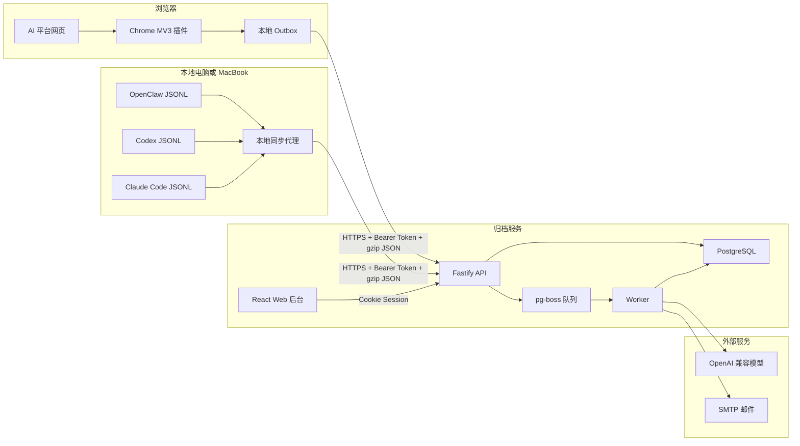
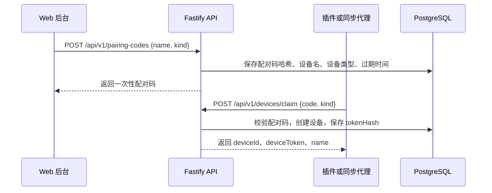
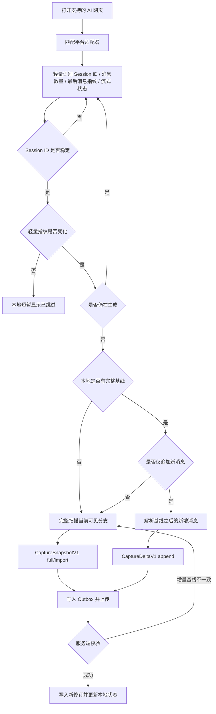
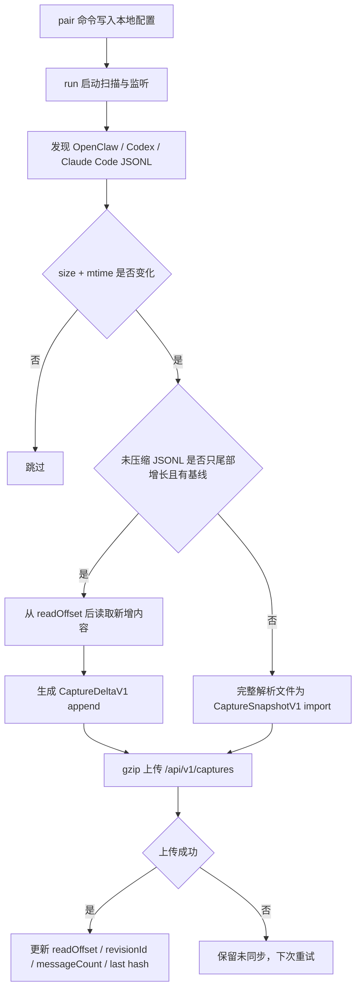
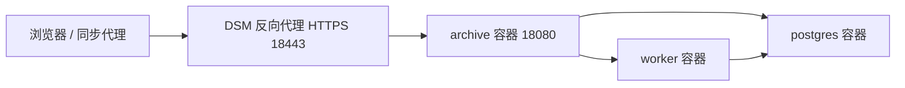

# 系统设计文档

## 1. 设计目标

`AI Conversation Archive` 是一个个人自托管的 AI 会话归档与项目知识系统。设计重点不是替代第三方 AI 产品，而是把跨平台会话稳定保存到用户自己的数据库中，并提供可追踪的 AI 二次整理能力。

核心设计目标：

1. 采集链路低干扰，识别到稳定会话后自动运行。
2. 归档数据有明确来源、版本和完整性证据。
3. 异步任务可重试、可观察、可排错。
4. AI 调用尽量节省上下文，只在必要时使用模型。
5. 敏感数据尽量留在本地，发往模型前脱敏。
6. 平台适配器可独立演进，单个平台失效不影响其他平台。

## 2. 总体架构



## 3. 代码模块

| 模块 | 职责 |
| --- | --- |
| `apps/server` | API、认证、设备配对、采集入库、导入、备份恢复、队列、AI 分析、邮件、日志、数据库迁移。 |
| `apps/web` | 管理后台 UI，包括仪表盘、会话、项目、报告、导入、设备、日志、设置和备份恢复。 |
| `apps/extension` | Chrome 插件，完成网页适配、轻量变化检测、完整/增量采集、本地 outbox、压缩上传、悬浮状态窗。 |
| `apps/openclaw-sync` | CLI/常驻代理，读取 OpenClaw、Codex、Claude Code 本地 JSONL 文件并上传完整导入或增量。 |
| `packages/contracts` | 统一采集协议、设备配对协议、知识抽取协议和运行时校验。 |
| `deploy` | Docker Compose 部署文件。 |
| `scripts` | 备份、恢复、API 冒烟测试等脚本。 |

## 4. 核心数据流

### 4.1 设备配对



设计要点：

1. 设备名称只在后台创建配对码时输入。
2. 插件和同步代理只输入配对码。
3. 设备令牌只返回一次，服务端只保存哈希。
4. 后台可以重命名设备、撤销设备、删除已撤销设备。

### 4.2 Chrome 自动采集



插件触发入口包括 DOM 变化、URL 路由变化、Session Key 变化、手动重试和 outbox 重传。但这些入口只有两类行为：

1. 轻量检查：读取当前平台、Session ID、消息节点数量、最后消息 ID、最后消息角色、最后消息正文 SHA-256、流式状态和适配器版本。
2. 正式采集：只有轻量指纹变化且页面稳定时执行。

完整采集触发条件：首次新会话、本地状态丢失、消息数量减少、最后旧消息找不到或内容变化、分支变化、适配器版本变化、服务端返回 `incremental_base_mismatch`、用户手动重试。新增回答在已有完整基线时优先走增量采集。上传失败只重试 outbox，不重新扫描页面。

### 4.3 平台适配器与角色识别

每个平台在 `apps/extension/lib/adapters/definitions.ts` 中声明独立适配规则：

| 字段 | 说明 |
| --- | --- |
| `provider` | 平台标识，例如 `chatgpt`、`yuanbao`、`qianwen`。 |
| `version` | 适配器版本，写入快照。 |
| `hosts` | 支持的域名。 |
| `sessionPatterns` | 从 URL 路径提取会话 ID 的正则。 |
| `sessionQueryKeys` | 从 QueryString 提取会话 ID 的候选键。 |
| `messageSelectors` | 找到消息节点的选择器。 |
| `userHints` | 判断用户消息的 DOM 提示。 |
| `assistantHints` | 判断 AI 回复的 DOM 提示。 |
| `reasoningSelectors` | 判断推理分段的 DOM 提示。 |
| `toolSelectors` | 判断工具状态或搜索过程的 DOM 提示。 |
| `streamingSelectors` | 判断页面仍在生成中的 DOM 提示。 |

角色识别原则：

1. 优先依赖页面标签、属性、组件名和 CSS 类名。
2. 只有在页面没有明确结构时，才使用更宽松的选择器和启发式判断。
3. 不能仅凭“这段内容像问题”或“这段内容像回答”作为主判据。
4. 对 Grok 这类页面，适配器可以利用 `data-testid='user-message'` 与 `data-testid='assistant-message'`。
5. 对元宝、千问这类页面，如果缺少明确角色标记，只能依赖类名、消息容器和平台结构，准确率受页面 DOM 变化影响。

腾讯元宝当前会话 ID 规则为：

```text
https://yuanbao.tencent.com/chat/<space-or-account-id>/<conversation-id>
```

系统应将 `<space-or-account-id>/<conversation-id>` 两段整体作为 `externalSessionId`，避免不同会话都落到第一段导致重复。

### 4.4 采集入库

服务端 `POST /api/v1/captures` 接收 `CaptureSnapshotV1`。快照经过共享协议校验后写入数据库。

入库策略：

1. 会话唯一键：`provider + externalSessionId`。
2. 修订唯一键：`conversationId + snapshotHash`。
3. 采集请求幂等键：`deviceId + Idempotency-Key`。
4. 新修订写入 `conversation_revisions`、`messages`、`message_segments`。
5. 内容未变时返回 `unchanged: true`，不重复写入消息。
6. 成功或失败都写入 `capture_runs` 和操作日志。
7. 如果开启 `classification.autoOnCapture`，新修订会尝试入队单会话归类任务。

### 4.5 本地同步代理



同步代理设计为只读本地会话文件，不读取模型密钥、平台 Cookie 或账号凭据。代理可以运行在独立 MacBook 上，只要能访问归档服务地址即可。`.gz` 压缩轮换文件按完整历史文件处理；未压缩 JSONL 才进行 offset 增量读取。

### 4.6 历史导入

历史导入支持两条入口：

1. Web 后台上传 ZIP。
2. Worker 定时扫描 `IMPORT_INBOX` 目录。

除 ChatGPT 官方 ZIP 和 Gemini Takeout 外，Worker 还支持 Chat Memo 的文本 ZIP。Chat Memo 文件按平台标识解析为独立快照；URL 中的 Session ID 用作 `provider + externalSessionId` 幂等键，混合平台任务在 `stats.providers` 中记录平台列表。

导入任务使用文件 SHA-256 去重。任务进入 `import-archive` 队列，由 Worker 异步解析，job 过期时间显式设置为 6 小时，避免大 ZIP 被 PgBoss 默认 15 分钟超时打断。解析完成后移动到 processed 目录，失败后移动到 failed 目录，并在 `import_jobs` 和 `operation_logs` 中记录状态。

导入页刷新、Worker 启动和 inbox 扫描都会检查 processing 状态的导入任务。如果任务长时间没有更新且 PgBoss 中已没有对应的 created/retry/active job，源 ZIP 仍在 inbox 时会自动改回 queued 并重新入队；源文件缺失时会标记 failed，避免 UI 长期误判为仍在解析。

### 4.7 系统备份与恢复

Web 后台备份是逻辑业务备份，面向“重建网站后导入数据”的场景。它通过 `GET /api/v1/backups/export` 生成 gzip JSON 文件，通过 `POST /api/v1/backups/import` 上传恢复。

备份包含：

1. 设备、会话、修订、消息、消息分段和采集记录。
2. 项目、会话项目归属、知识、分析运行、后台任务和报告。
3. 设置、脱敏规则、历史导入记录和操作日志。

备份不包含：

1. `users` 管理员账号。
2. `web_sessions` 登录会话。
3. `pairing_codes` 一次性配对码。

导入时先按外键依赖反序删除业务表，再按依赖顺序恢复业务表。当前新站点的管理员账号会保留。备份文件记录 `APP_MASTER_KEY` 指纹；如果当前密钥不同，导入会跳过加密设置，避免 API Key/SMTP 密码用错误密钥恢复后无法解密。

### 4.8 智能归类

智能归类有两类队列：

| 队列 | 用途 |
| --- | --- |
| `classify-conversation` | 单个会话归类，通常由采集后自动触发。 |
| `reclassify-unlocked` | 批量归类任务。默认先筛增量候选；完整重评时处理全部未人工锁定会话。 |

归类运行模式：

| 模式 | 行为 | 适用场景 |
| --- | --- | --- |
| 节能模式 `economy` | 复用稳定结果，本地项目名匹配优先，必要时才调用 AI。 | 日常使用，减少上下文和费用。 |
| 完整模式 `full` | 对未锁定会话强制重新评估。 | 测试、纠错、项目结构大改后重跑。 |

批量归类还有 `scope`：

| 范围 | 行为 |
| --- | --- |
| `incremental` | 默认。SQL 先筛出无项目、低置信度、无归类记录或归类时间早于最新修订的未锁定会话。 |
| `all` | 显式完整重评全部未锁定会话。 |

节省上下文的机制：

1. 默认增量候选：日常手动归类和自动重归类不再按总会话数扫描正文，而是在数据库层先筛出需要评估的候选。
2. 稳定分类复用：置信度大于等于 `0.78` 且分类时间不早于最新修订时，节能模式直接复用。
3. 本地命中：标题、已有建议名、正文前部匹配项目名时不调用 AI。
4. 输入截断：`classification.maxConversationChars` 默认 8000，配置范围 2000 到 40000。
5. 批量任务逐条处理，单条失败只计入失败样本，不中断整批。
6. 手动批量归类按批次续跑：单个 `reclassify-unlocked` job 到达批次数量或软时间上限后，会把下一批重新入队，任务总进度继续累计在同一个 `background_tasks` 记录中；job 过期时间显式设置为 6 小时。
7. 续跑使用首次筛出的固定候选 ID 列表和顺序，避免上一批写入归类结果后导致下一批 offset 跳过未处理会话。
8. 长时间没有进度更新的 queued/running 任务会被自动标记失败，避免页面长期误判为运行中。
9. 用户锁定项目后，不再进入自动覆盖路径。

任务进度写入 `background_tasks`：

```text
totalCount, processedCount, succeededCount, failedCount, message, stats
```

`stats` 包含 attempted、analyzed、classified、suggested、skipped、failed、aiCalls、localMatches、cached、mode、scope、candidateReasons、maxConversationChars、reuseStable、failureSamples 等。

### 4.9 周报与月报

报告运行队列：

| 队列 | 用途 |
| --- | --- |
| `analysis-weekly` | 周报生成。 |
| `analysis-monthly` | 月报生成。 |
| `email-report` | 报告生成后发送邮件。 |

周期计算使用 `Asia/Shanghai`：

1. 周报：上一个完整周一到周一。
2. 月报：上一个完整自然月。

周报流程：

1. 选取周期内完整会话的最新修订。
2. 对会话执行项目归类。
3. 对归类到项目的会话抽取知识。
4. 基于触达项目和知识生成周报。
5. 没有知识时生成本地占位周报。

月报流程：

1. 读取所有未归档项目和最近知识。
2. 调用模型合并知识状态。
3. 生成月度项目演进报告。
4. 没有知识时生成本地占位月报。

报告模型输出使用结构化 JSON。系统支持以下容错：

1. 模型返回纯字符串时转换为报告正文。
2. 模型返回 `report`、`weeklyReport`、`monthlyReport`、`result`、`data` 等包裹字段时自动展开。
3. 模型使用 `bodyMarkdown`、`body_markdown`、`markdown`、`content`、`body`、`text` 等字段时自动归一化。
4. 月报缺少 `statusUpdates` 时按空数组处理。

### 4.10 AI 运行方式

AI 调用统一通过 `apps/server/src/services/llm.ts`：

1. 使用 OpenAI 兼容 Chat Completions API。
2. 配置项包括 `llm.baseUrl`、`llm.apiKey`、`llm.model`。
3. 首选 `response_format: { type: "json_object" }`。
4. 如果上游不支持 `response_format`，自动降级为普通调用。
5. 响应必须提取 JSON 并通过 Zod Schema 校验。
6. 校验失败时返回精简错误摘要，避免把超长模型输出写满日志。
7. 模型连接测试使用短超时和短输出，验证 Base URL、API Key、模型名是否可用。

发送给模型的数据会先经过脱敏。会话材料默认只包含用户与 AI 正文，不包含 `reasoning` 和 `tool_status` 分段。

### 4.11 任务状态和日志

任务状态聚合接口 `/api/v1/activity` 汇总：

1. 批量分类任务。
2. 周报、月报分析任务。
3. 历史导入任务。
4. 近 24 小时采集异常摘要。

仪表盘 `/api/v1/dashboard` 聚合：

1. 会话、项目、知识、活跃设备数量。
2. 已归类会话、未归类会话、空分类和活跃分类数量。
3. 分类分布、每个分类的会话数、知识数和近 7 日增长。
4. 当前每个会话最新修订的总文本量，并按 1 token 约等于 1.7 个字符粗估 token。
5. 近 24 小时采集完整、部分、失败数量。
6. 近 24 小时按平台汇总的采集健康度。
7. 最近报告。

日志 `/api/v1/logs` 保存操作事件，支持按范围、级别、AI 平台、状态和关键字过滤。范围包括：

```text
analysis, capture, classification, device, import, system
```

级别包括：

```text
info, warning, error
```

### 4.12 前端页面

| 页面 | 路径 | 说明 |
| --- | --- | --- |
| 仪表盘 | `/` | 归档规模、分类分布、近 7 日增长、文本量、近 24 小时采集健康和最近报告。 |
| 会话 | `/conversations` | 紧凑会话列表、搜索、平台/来源/时间/完整性/采集模式过滤、搜索命中摘要、分页。 |
| 会话详情 | `/conversations/:id` | 会话消息、修订版本、来源平台、原始 URL、来源设备、采集模式、触发原因、项目绑定、删除。 |
| 项目 | `/projects` | 项目列表、创建编辑、归档、知识、未归类、智能归类进度。 |
| 报告 | `/reports` | 周报/月报列表、分析运行状态、立即生成。 |
| 报告详情 | `/reports/:id` | 查看报告标题、摘要和 Markdown 正文。 |
| 导入 | `/imports` | 上传 ZIP、查看导入任务状态。 |
| 设备 | `/devices` | 创建设备配对码、编辑设备名、撤销和删除设备。 |
| 日志 | `/logs` | 操作日志过滤与排错。 |
| 设置 | `/settings` | LLM、SMTP、报告开关、分类策略、脱敏规则、模型测试、备份与恢复。 |

## 5. 安全设计

1. Web 用户必须登录，登录使用密码和 TOTP。
2. 设备上传必须使用 Bearer Token。
3. 设备 Token 只存哈希，可撤销。
4. 生产环境远程访问强制 HTTPS。
5. 敏感设置使用 `APP_MASTER_KEY` 加密。
6. 插件只申请归档服务和支持 AI 平台的 host 权限，不申请通配服务器权限。
7. 插件不读取 Cookie，不上传 Cookie。
8. 发往 LLM 的内容经过脱敏。
9. 分析提示中明确把会话数据视为不可信输入，避免执行会话内嵌指令。

## 6. 部署形态

NAS 部署推荐形态：



推荐只对外暴露 HTTPS 入口，不直接暴露 PostgreSQL、DSM 管理口或内部应用端口。

## 7. 失败处理

| 场景 | 处理方式 |
| --- | --- |
| 插件网络失败 | payload 留在 outbox，后台定时重试，不重新扫描页面。 |
| 服务端校验失败 | 返回 400，记录 capture 失败日志。 |
| 增量基线不一致 | 返回 409 和 `requiresFullCapture: true`，客户端回退完整采集。 |
| 同步代理上传失败 | 不更新本地 state，下次扫描继续重试。 |
| 单条分类失败 | 计入失败样本，批量任务继续。 |
| 报告正在运行 | 同周期运行有幂等保护，避免重复跑。 |
| 模型 JSON 不标准 | 提取首个 JSON、展开包裹字段、归一化别名字段。 |
| 无知识可报告 | 生成本地占位报告。 |
| SMTP 未配置 | 报告仍保存到 Web 后台，跳过邮件发送。 |
| 备份密钥不一致 | 跳过加密设置并提示重新填写敏感配置。 |

## 8. 可演进点

1. 为容易变化的平台适配器增加更多 fixture 和回归测试。
2. 给采集失败样本增加 DOM 诊断导出，便于快速修适配器。
3. 给分类和报告增加更细的 token 估算和预算上限。
4. 增加批量重建搜索索引和知识索引工具。
5. 在 NAS 页面增加升级状态检查和迁移状态提示。
